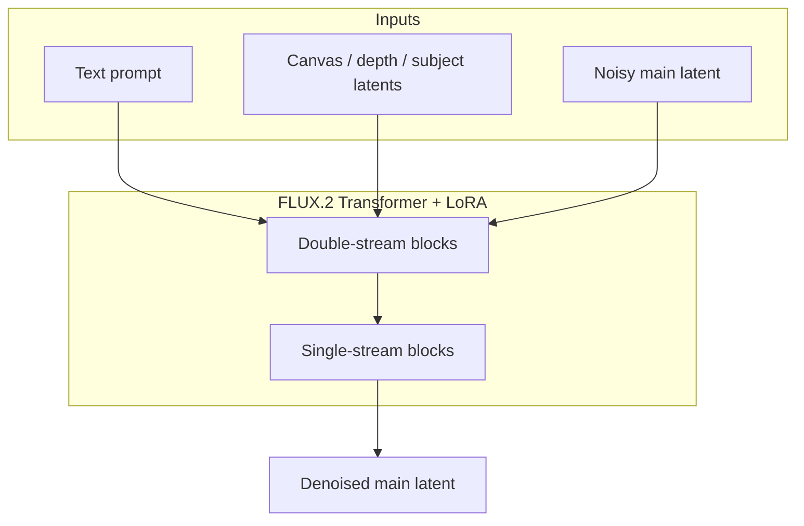
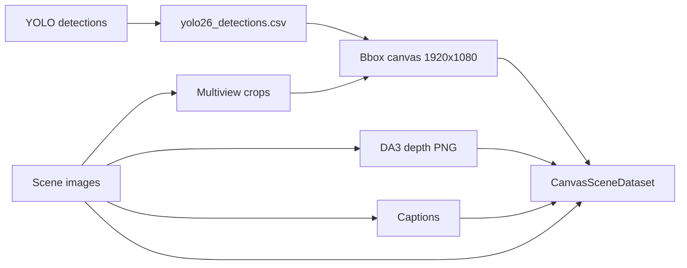

# Architecture

RefCompose extends FLUX diffusion transformers with **multi-stream conditioning**: the model jointly attends over text tokens, main (noisy) image tokens, and one or more conditioning token blocks (canvas layout, depth map, subject, or spatial control).

## High-Level Overview



Two training stacks exist:

| Stack | Base model | Pipeline | Primary use |
|-------|------------|----------|-------------|
| FLUX.1 | `FluxTransformer2DModel` | `FluxPipeline` | JSONL spatial/subject/style control |
| FLUX.2 | `Flux2Transformer2DModelCond` | `Flux2Pipeline` + custom denoise | Canvas + depth composition |

## Three Token Streams (FLUX.2)

During each forward pass the transformer operates on:

1. **Main image tokens** \(x^m\) — the noisy latent being denoised
2. **Condition tokens** \(x^c\) — canvas and/or depth latents packed along the sequence
3. **Text tokens** \(x^t\) — encoded prompt (Mistral3 + Pixtral for FLUX.2)

With unified resolution (e.g. 1280×720), main and cond streams typically have equal token counts.

Implementation: `scripts/train/src/flux2_transformer_cond.py`

## Double-Stream Block: Concatenation

Before attention, each stream is AdaLayerNorm-modulated, then main and cond are concatenated:

```
norm_img_in = concat(norm_hidden_states, norm_cond)   # dim=sequence
```

Text is normalized separately. This matches FLUX.2's double-stream design with an extra cond branch.

## Joint Attention and Masking

Q/K/V are computed for the full joint sequence (text + main + cond). An attention mask \(M\) enforces **canvas isolation**:

| Row (query) | Can attend to (key) |
|-------------|---------------------|
| Text, main | Everything |
| Canvas block \(k\) | Only tokens in canvas block \(k\) |

Forbidden pairs receive a large negative bias (\(-10^{20}\)) before softmax.

**Effect:** Main image tokens can read canvas/depth information; each cond block only self-attends, preventing cross-contamination between cond streams.

## LoRA on Q/K/V

Low-rank adapters specialize attention per conditioning block:

```
W_eff = W + (alpha / r) * B @ A
```

Each LoRA uses a **token mask** so it only applies to its assigned canvas block:

- `lora_num=1` — single canvas LoRA
- `lora_num=2` — canvas LoRA + depth LoRA (typical for RefCompose)

Implementation: `scripts/train/src/layers_flux2.py` (`LoRALinearLayerFlux2`, `MultiDoubleStreamBlockFlux2LoraProcessor`)

## Training Objective

Flow-matching loss is computed on **main tokens only**:

```
L = E[ || f_theta(.) - (z - x_clean) ||^2_w ]
```

Gradients flow back through attention paths where main tokens queried cond keys/values. Canvas tokens receive no direct supervision — the model learns to use them because they improve main-stream prediction.

## Canvas Conditioning Pipeline



At training time (`CanvasSceneDataset`):

1. Load target RGB image (cover-cropped to unified size, default 1280×720)
2. Build or load canvas composite (bbox crops pasted on black/scaled background)
3. Optionally load depth map (16-bit PNG → RGB tensor)
4. Apply augmentations: random canvas/depth dropout, coarse depth degradation
5. Encode to latents via FLUX.2 VAE; pack cond tokens after main tokens

Geometry is shared between dataset prep (`stage4_canva.py`) and runtime compose (`canvas_bbox_compose.py`).

## FLUX.1 Control Modes

The JSONL training path supports three conditioning types via column selection:

| Mode | `--spatial_column` | `--subject_column` | Description |
|------|-------------------|-------------------|-------------|
| Spatial | `source` | `None` | Pose, canny, depth maps, etc. |
| Subject | `None` | `source` | Reference subject image |
| Style | `source` | `None` | Style reference image |

LoRA processors in `layers.py` attach to FLUX.1 double/single stream blocks. KV cache in attention processors enables efficient multi-LoRA inference (`lora_helper.py`).

## Inference Stages (infer_v2)

| Stage | Script | Purpose |
|-------|--------|---------|
| 1 | `flux2_heritage_infer.py` | Text-to-image base generation |
| 2 | `stage2_depth.py` | Monocular depth (DA3) |
| 3 | `stage3_lora_infer.py` | Canvas + depth LoRA refinement |

Stage 3 reuses training validation denoise logic (`flux2_dataloader_validation._denoise_one`) for bit-exact parity with training.

## Key Design Decisions

1. **Cover crop (not letterbox)** for unified training/inference resolution — preserves aspect ratio by trimming edges.
2. **Depth coarse augmentation** during training — forces the model to rely on canvas for appearance, depth for geometry.
3. **Balanced sampling** across multiple dataset roots — equal probability per root even when CSV lengths differ.
4. **Batch size 1** — required for variable-resolution targets in JSONL mode; canvas mode also uses batch 1 with unified resolution.

## Further Reading

- Detailed math walkthrough: `scripts/train/doc.md`
- Cond attention processor: `scripts/train/src/flux2_transformer_cond.py`
- Canvas dataset logic: `scripts/train/src/canvas_dataset.py`
