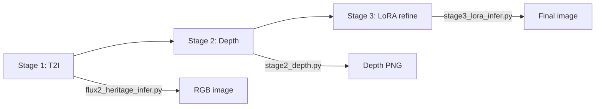

# Inference

RefCompose inference lives primarily in `scripts/infer_v2/` (FLUX.2 canvas + depth) with additional experimental compositing scripts in `scripts/infer/`.

## Overview: Three-Stage Pipeline



| Stage | Script | Input | Output |
|-------|--------|-------|--------|
| 1 | `flux2_heritage_infer.py` | Text prompt | RGB PNG + prompt sidecar |
| 2 | `stage2_depth.py` | RGB image | 16-bit depth PNG |
| 3 | `stage3_lora_infer.py` | Canvas + depth + prompt | LoRA-refined PNG |

---

## Stage 1: Text-to-Image Generation

**Script:** `flux2_heritage_infer.py`

Generates Indian heritage interior scenes using FLUX.2-dev with a built-in detailed prompt (`HERITAGE_INTERIOR_PROMPT`).

### Quick Start

```bash
cd scripts/infer_v2

# 4 variants, seeds 42–45
CUDA_VISIBLE_DEVICES=0 ./run.sh

# Single image
VARIANTS=1 ./run.sh

# Direct Python
python flux2_heritage_infer.py --variants 4 --seed 42
```

### Options

| Flag / Env | Default | Description |
|------------|---------|-------------|
| `--variants` / `VARIANTS` | 4 | Number of images |
| `--seed` / `SEED` | 42 | Base seed |
| `--num-inference-steps` / `STEPS` | 50 | Denoise steps |
| `--guidance-scale` / `GUIDANCE` | 4.0 | CFG scale |
| `--width` / `WIDTH` | 1280 | Output width |
| `--height` / `HEIGHT` | 720 | Output height |
| `FLUX2_MODEL` | FLUX.2-dev snapshot | Base model path |

Outputs: `outputs/heritage_interior_var01_seed42.png` + `.txt` sidecar.

---

## Stage 2: Depth Estimation

**Script:** `stage2_depth.py`

Monocular depth using Depth Anything 3 (DA3-BASE). Produces training-compatible 16-bit grayscale PNGs.

### Quick Start

```bash
pip install -r requirements-da3.txt

CUDA_VISIBLE_DEVICES=0 ./run_depth.sh

# Single image
python stage2_depth.py -i generated_image/image_gen.png

# Batch folder
python stage2_depth.py -i outputs --batch
```

### Depth Format

- Mode: `I;16` (16-bit grayscale)
- Values: linear relative depth in [0, 65535]
- Must match `load_depth_image_as_rgb_pil()` expectations in training code

Output naming: `{stem}_depth.png` or `{stem}.png` in a `depth/` subfolder.

---

## Stage 3: Canvas + Depth LoRA

**Script:** `stage3_lora_infer.py`

Refines a generated image using trained canvas + depth LoRA weights. This is the primary RefCompose inference path.

### Default Inputs

| File | Purpose |
|------|---------|
| `generated_image/black_canvas.jpg` | Layout canvas (bbox composite or blank) |
| `generated_image/image_gen_depth.png` | Depth map from stage 2 |
| `generated_image/image_gen.txt` | Text prompt |

### Quick Start

```bash
chmod +x run_lora.sh
CUDA_VISIBLE_DEVICES=0 ./run_lora.sh

# Depth-heavy first steps, then appearance
LORA_FIRST_DEPTH_STEPS=4 ./run_lora.sh

# Direct Python
python stage3_lora_infer.py --no-canvas_depth_coarse_augment --lora_first_depth_steps 4
```

### Key Options

| Flag / Env | Default | Description |
|------------|---------|-------------|
| `LORA_PATH` / `--lora_path` | checkpoint path | Trained LoRA safetensors |
| `--lora_first_depth_steps` | 0 | Steps with depth-weighted denoise first |
| `--no-canvas_depth_coarse_augment` | — | Use sharp DA3 depth (skip training-style degradation) |
| `--guidance-scale` | 4.0 | CFG during LoRA denoise |
| `--num-inference-steps` | 50 | Total denoise steps |
| `--seed` | 42 | Random seed |

Unified frame: **1280×720 cover crop** (no letterbox padding).

### Output

Default: `outputs/image_gen_lora.png` + prompt sidecar.

---

## Guidance Scale Sweep

**Script:** `run_guidance_sweep.py`

Runs stage 3 across multiple guidance scales with a single model load:

```bash
python run_guidance_sweep.py
python run_guidance_sweep.py --scales 1 2 3 4 --seed 42
```

Default scales: 1.0 through 10.0 in 0.5 steps. Outputs: `image_gen_lora_gs{N}.png`.

---

## LoRA Server (FastAPI)

**Scripts:** `lora_server.py`, `lora_client.py`

Loads FLUX.2 + LoRA once and serves HTTP requests.

### Start Server

```bash
cd scripts/infer_v2
CUDA_VISIBLE_DEVICES=0 python lora_server.py --port 8767
```

### Request Format

POST `/generate` with a folder path containing:

```
folder/
├── black_canvas.jpg
├── image_gen_depth.png
└── image_gen.txt
```

Server writes `image_gen_lora.png` + sidecar into the same folder.

### Client

```bash
python lora_client.py --url http://127.0.0.1:8767 --folder /path/to/inputs
```

Uses a threading lock for sequential GPU access.

---

## Shell Script Reference

| Script | Purpose |
|--------|---------|
| `run.sh` | Stage 1 heritage generation |
| `run_depth.sh` | Stage 2 depth |
| `run_lora.sh` | Stage 3 LoRA inference |
| `run_guidance_sweep.sh` | Guidance scale sweep wrapper |

All scripts respect `CUDA_VISIBLE_DEVICES` and environment variable overrides.

---

## Object Editing (`scripts/infer/`)

Experimental compositing scripts using Grounding DINO for detection:

| Script | Purpose |
|--------|---------|
| `replace_objects.py` | Replace detected objects (pot, lamp) with reference images |
| `replace_objects_srk_var03.py` | Variant with different scene setup |
| `replace_objects_aish.py` | Another variant |
| `add_objects_baji.py` | Add objects to scenes |

These scripts:

1. Load a scene image (often background-removed)
2. Run Grounding DINO zero-shot detection
3. Paste replacement RGBA crops at detected bbox locations

They are standalone experiments, not integrated with the LoRA pipeline.

---

## FLUX.1 Server Mode (Legacy)

If a FLUX.1 server is running (`infer/flux_server/server_flux.py`):

```bash
python client_flux.py \
  --url http://127.0.0.1:8765 \
  --caption "your prompt" \
  --variants 4 \
  -o outputs/output.png
```

---

## Tips

1. **Match training resolution** — Use 1280×720 cover crop for canvas/depth inputs when the model was trained at that size.
2. **Depth degradation** — By default, inference applies the same coarse depth augmentation as training. Use `--no-canvas_depth_coarse_augment` for crisp DA3 output.
3. **Canvas content** — A `black_canvas.jpg` (empty layout) still works; the model uses depth + prompt. For object placement control, provide a bbox composite canvas.
4. **VRAM** — Stage 3 loads VAE, text encoder, and transformer. Use `enable_model_cpu_offload()` pattern from stage 1 if needed.
5. **Seed reproducibility** — Set `--seed` explicitly; variant scripts increment by `--seed-step` (default 1).

---

## Next Steps

- [API Reference](api-reference.md) — Python module details
- [Configuration](configuration.md) — environment variables and data formats
